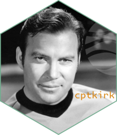

<!-- README.md is generated from README.Rmd. Please edit that file -->

```{r, include = FALSE}
knitr::opts_chunk$set(
  collapse = TRUE,
  comment = "#>",
  fig.path = "man/figures/README-",
  out.width = "100%"
)
```

# cptkirk 

<!-- badges: start -->
[](https://lifecycle.r-lib.org/articles/stages.html#experimental)
<!-- badges: end -->

**Warp speed.** `cptkirk` is a remote, overview-aware `gdalwarp`.

It combines two tools that are each best-in-class at one thing:

- [`async-tiff`](https://github.com/developmentseed/async-tiff) saturates
  remote byte-range reads of (Cloud-Optimised) GeoTIFFs and decodes tiles
  concurrently.
- **GDAL** (via [`gdalraster`](https://firelab.github.io/gdalraster/index.html))
  is the best warper there is.

`cptkirk` is the thin pipe between them. From a `gdalwarp`-style request it
works out exactly which source pixels the warp will need, streams only those
tiles over `async-tiff` at the appropriate overview level, stages them as an
in-memory GDAL source, then hands the actual reprojection and resampling to
GDAL. It reimplements none of GDAL's warp logic; it only sizes the fetch.

## Installation

```r
# requires a Rust toolchain (rustc >= 1.78) and GDAL (via gdalraster)
pak::pak("belian-earth/cptkirk")
```

## Usage

```{r}
library(cptkirk)

# inspect a remote COG (header + IFDs only, no pixels fetched)
url <- paste0(
  "https://data.source.coop/tge-labs/aef/v1/annual/2021/36S/","xekh5rjs4wg6wb9b4-0000000000-0000000000.tiff")

cog_info(url)

# warp an area of interest straight to a local GeoTIFF
r <- warp_remote(
  src    = url,
  dst    = tempfile(fileext = ".tif"),
  tr     = c(30, 30),                  # target resolution
  r      = "average",
  bands  = c(1, 2, 3)                   # subset bands
)


ds <- new(gdalraster::GDALRaster, r)
gdalraster::plot_raster(ds, xsize=800, ysize=800)
ds$close()

```

`te`/`tr`/`ts`/`r`/`t_srs` follow the `gdalwarp` interface. Any additional raw
`gdalwarp` flags pass straight through via `cl_arg` and are forwarded to
`gdalraster::warp()`.

## How it picks what to fetch

1. **Window.** The target extent is reprojected into the source CRS (with
   edge densification) to find the source-pixel window the output covers.
2. **Overview.** The target resolution is mapped into source units to pick the
   finest overview level whose decimation does not exceed what the output
   needs.
3. **Bands.** `bands =` subsets at the fetch, so only the requested bands'
   bytes are streamed.

The streamed window becomes an in-memory GDAL dataset; GDAL does the rest.
