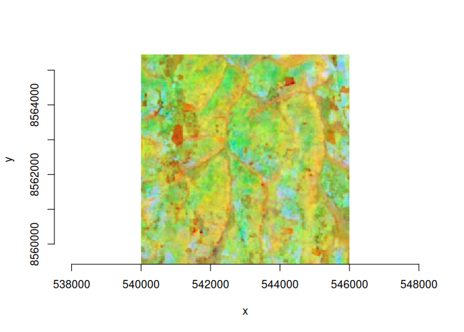

# cptkirk

**“Warp speed!”** `cptkirk` warps remote Cloud-Optimised GeoTIFFs fast:
it saturates the network with concurrent reads, then hands the warp to
GDAL.

It combines two tools that are each best-in-class at one thing:

- [`async-tiff`](https://github.com/developmentseed/async-tiff)
  saturates remote byte-range reads of (Cloud-Optimised) GeoTIFFs and
  decodes tiles concurrently.
- **GDAL** (via
  [`gdalraster`](https://firelab.github.io/gdalraster/index.html)) is
  the best warper there is.

`cptkirk` is the thin pipe between them. From a `gdalwarp`-style request
it works out exactly which source pixels the warp will need, streams
only those tiles over `async-tiff` at the appropriate overview level,
stages them as an in-memory GDAL source, then hands the actual
reprojection and resampling to GDAL. It reimplements none of GDAL’s warp
logic; it only sizes and saturates the fetch.

## When it helps

`cptkirk`’s single lever is I/O concurrency: it wins by scattering many
small byte-range reads and keeping the network saturated. That pays off
on **multi-band rasters**, where `bands =` streams a subset of band
planes concurrently. Embedding stacks with tens of bands are the case it
was built for.

On a **single-band asset** there is no band subset to exploit and the
read is one contiguous tile stream per window: exactly the case GDAL’s
`/vsicurl` already handles well, so `cptkirk` adds little over it. Reach
for `cptkirk` when the source is multi-band; for single-band sources
plain GDAL is usually just as fast.

## Two ways in

- [`ck_warp()`](https://belian-earth.github.io/cptkirk/reference/ck_warp.html)
  is the recommended, batteries-included entry point, with named `t_srs`
  / `te` / `tr` / `ts` / `r` / `bands` arguments plus sensible defaults
  (multi-threaded warp, generous working memory, and `tr`-grid-aligned
  output so tiles at the same resolution stack cleanly).
- [`warp_remote()`](https://belian-earth.github.io/cptkirk/reference/warp_remote.html)
  is a faithful, defaults-free sibling of
  [`gdalraster::warp()`](https://firelab.github.io/gdalraster/reference/warp.html),
  with the same `src` / `dst` / `t_srs` / `cl_arg` call shape but the
  source streamed remotely. Reach for it when you want GDAL’s exact
  behaviour with full control via `cl_arg`.

Both validate the request against a tiny in-memory probe *before*
fetching, so a bad CRS, resampling method or creation option fails in
milliseconds instead of after a download.

## Installation

``` r

# requires a Rust toolchain (rustc >= 1.78) and GDAL (via gdalraster)
pak::pak("belian-earth/cptkirk")
```

## Usage

``` r

library(cptkirk)

# inspect a remote COG (header + IFDs only, no pixels fetched)
url <- paste0(
  "https://data.source.coop/tge-labs/aef/v1/annual/2021/36S/",
  "xekh5rjs4wg6wb9b4-0000000000-0000000000.tiff"
)

(m <- cog_info(url))
#> ── cog_info ────────────────────────────────────────────────────────────────────
#> <https://data.source.coop/tge-labs/aef/v1/annual/2021/36S/xekh5rjs4wg6wb9b4-0000000000-0000000000.tiff>
#> size: 8192 x 8192 px (67.1 Mpx)
#> bands: 64 Int8
#> resolution: 10 (CRS units)
#> crs: EPSG:32736
#> nodata: -128
#> overviews: 13 (8192x8192, 4096x4096, 2048x2048, 1024x1024, 512x512, 256x256,
#> 128x128, 64x64, 32x32, 16x16, 8x8, 4x4, 2x2, 1x1)
#> band names: "A00", "A01", "A02", "A03", "A04", "A05", …, "A62", and "A63"

# warp just a ~6 km window of the tile -- only the source tiles covering this
# extent are streamed
gt <- m$geotransform
x0 <- gt[1] + 4000 * gt[2]
y0 <- gt[4] + 4000 * gt[6]
te <- c(x0, y0 - 8000, x0 + 8000, y0)   # AOI in the tile's CRS (EPSG:32736)

r <- ck_warp(
  src   = url,
  dst   = tempfile(fileext = ".tif"),
  te    = te,                # area of interest
  tr    = c(15, 15),         # 15 m output (an overview is selected)
  r     = "average",
  bands = c(11,10,9)         # subset bands at the fetch
)

ds <- new(gdalraster::GDALRaster, r)
gdalraster::plot_raster(ds)
```



``` r

ds$close()
```

`t_srs` / `te` / `tr` / `ts` / `r` follow the `gdalwarp` interface, and
any extra raw flags pass straight through via `cl_arg`.
[`ck_warp()`](https://belian-earth.github.io/cptkirk/reference/ck_warp.md)
aligns output to the `tr` grid by default (gdalwarp `-tap`); set
`tap = FALSE`, or use
[`warp_remote()`](https://belian-earth.github.io/cptkirk/reference/warp_remote.md),
for GDAL’s exact requested extent.

### Pixels straight into R

[`ck_read()`](https://belian-earth.github.io/cptkirk/reference/ck_read.md)
is
[`ck_warp()`](https://belian-earth.github.io/cptkirk/reference/ck_warp.md)
that hands back a base-R array — carrying `geotransform` / `crs` /
`nodata` attributes — instead of writing a file, handy for quick
extraction and inspection:

``` r

a <- ck_read(url, te = te, tr = c(30, 30), bands = c(11, 10, 9))
dim(a)                # c(nrow, ncol, nband)
#> [1] 267 267   3
names(attributes(a))  # dim, plus geotransform / crs / nodata
#> [1] "dim"          "geotransform" "crs"          "nodata"
```

Warping many areas from the same raster? Open it once with
[`cog_source()`](https://belian-earth.github.io/cptkirk/reference/cog_source.html)
and pass the handle in place of the URL to pay the metadata round-trips
only once.

## Authentication

Remote object-store sources (`s3://`, `gs://`, `az://`) authenticate
from the **process environment** – and `cptkirk` reads the **same
variables as GDAL’s `/vsi*` drivers**, so an existing GDAL setup is a
drop-in:

| Provider | Set (GDAL names work as-is) |
|----|----|
| AWS S3 | `AWS_ACCESS_KEY_ID`, `AWS_SECRET_ACCESS_KEY`, `AWS_SESSION_TOKEN`, `AWS_REGION` |
| AWS, public bucket | `AWS_NO_SIGN_REQUEST=YES` (set `AWS_REGION` too) |
| AWS, custom endpoint | `AWS_S3_ENDPOINT`, `AWS_HTTPS`, `AWS_VIRTUAL_HOSTING`, `AWS_REQUEST_PAYER` |
| Google Cloud | `GOOGLE_APPLICATION_CREDENTIALS` (service-account JSON) |
| Azure Blob | `AZURE_STORAGE_ACCOUNT` + `AZURE_STORAGE_ACCESS_KEY` (or a SAS token) |

Most names are shared with `object_store` and forward verbatim; the
handful that differ (`AWS_S3_ENDPOINT`, `AWS_NO_SIGN_REQUEST`, the Azure
account name, …) are translated for you. Settings are read from the
environment or from
[`gdalraster::set_config_option()`](https://firelab.github.io/gdalraster/reference/set_config_option.html).
**No credential ever passes through R** – only the non-secret knobs
(endpoints, no-sign flags) are translated R-side; secrets go straight
from the environment into the reader. With no static credentials the
usual chain (web-identity, ECS, EC2 instance metadata) still applies.

## How it picks what to fetch

1.  **Window.** The target extent is reprojected into the source CRS
    (with edge densification) to find the source-pixel window the output
    covers.
2.  **Overview.** The target resolution is mapped into source units to
    pick the finest overview level whose decimation does not exceed what
    the output needs.
3.  **Bands.** `bands =` subsets at the fetch, so only the requested
    bands’ bytes are streamed.

The streamed window becomes an in-memory GDAL dataset; GDAL does the
rest.
